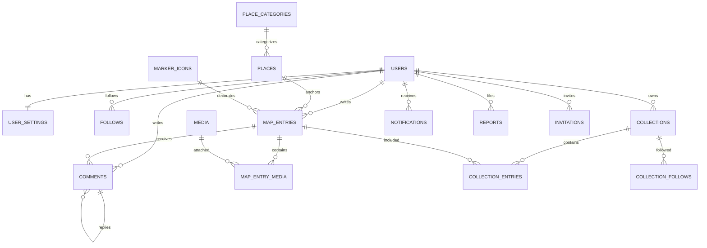

# ER-диаграмма

```mermaid
erDiagram
  USERS ||--|| USER_SETTINGS : has
  USERS ||--o{ FOLLOWS : follows
  USERS ||--o{ MAP_ENTRIES : writes
  USERS ||--o{ COLLECTIONS : owns
  USERS ||--o{ COMMENTS : writes
  PLACES ||--o{ MAP_ENTRIES : anchors
  PLACE_CATEGORIES ||--o{ PLACES : categorizes
  MARKER_ICONS ||--o{ MAP_ENTRIES : decorates
  MAP_ENTRIES ||--o{ MAP_ENTRY_MEDIA : contains
  MEDIA ||--o{ MAP_ENTRY_MEDIA : attached
  COLLECTIONS ||--o{ COLLECTION_ENTRIES : contains
  MAP_ENTRIES ||--o{ COLLECTION_ENTRIES : included
  COLLECTIONS ||--o{ COLLECTION_FOLLOWS : followed
  MAP_ENTRIES ||--o{ COMMENTS : receives
  COMMENTS ||--o{ COMMENTS : replies
  USERS ||--o{ NOTIFICATIONS : receives
  USERS ||--o{ REPORTS : files
  USERS ||--o{ INVITATIONS : invites
```
